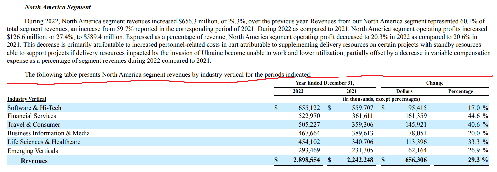
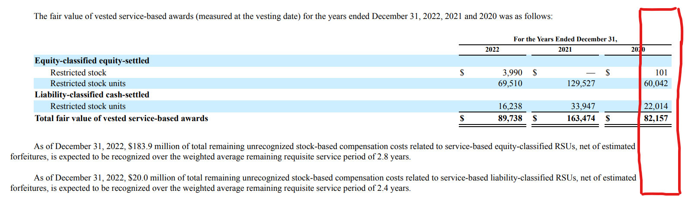
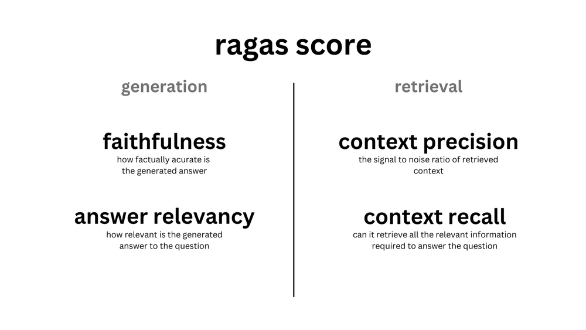
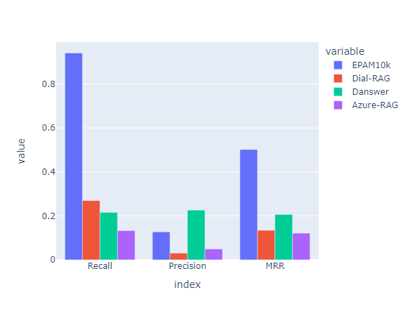
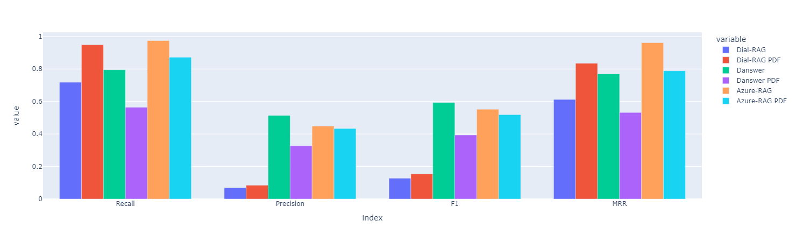
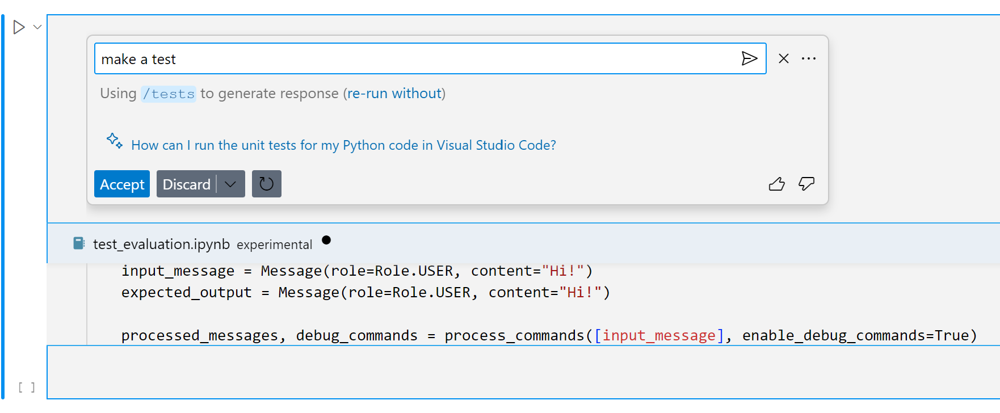

# Dial Rag evaluation approach

<!-- mermaid.js -->
<script type="module">
  import mermaid from 'https://cdn.jsdelivr.net/npm/mermaid@10.4.0/dist/mermaid.min.js';
  mermaid.initialize({ startOnLoad: true });
</script>

<style>
@import 'https://maxcdn.bootstrapcdn.com/font-awesome/4.7.0/css/font-awesome.min.css';
section {
  font-size: 24px;
}
</style>


---
# The presentation
- To discuss our RAG evaluation approach
- It is not a presentation of a ready to use tools
- Work in progress / prototypes
- Discussion of does it make sense / is useful for you


---

# Story

We are building some RAG solution for some customer:
- Why do we need the custom RAG?
  - Why not just throw the documents into Azure, Danswer, etc. ?
  - Or just copy-paste from the Langchain tutorial?
- Which building block to choose?
- How to tune the parameters (chunk size, embedding model, etc.)?
- Is the new version better that the old one?
- What should be improved?

---
# What do we need

We need the ways to:
- Evaluate the quality on the custom data / custom domain
  - Where to get ground truth data?
  - Is the evaluation data representative of the actual usage?
- Help to prepare some ground truth data
- Avoid dependency on chunking and parsing process as much as possible
- Look inside into the evaluation details

---

# Why not [tool name]?

- Why not mlflow, clearml, aimstack, dvc, pachyderm, etc?
- Most of them are for the model training (with training steps, convergence, etc.), not for RAG evaluation.
- Some parts of the tools are useful, but not enough for the whole process
- **If you could name ready-to-use tool for the whole process - it would be great!**

---
# One more RAG eval framework?


https://xkcd.com/927/

---
# What we are trying to build:
- Reuse some tools between RAGs evaluation pipelines
- Have some building blocks to start evaluation for new RAG projects
- You may use only the tools you need

---

# Suggested components:
- Some suggested retrieval metrics
- Some suggested dataset organization
- Some helpers to prepare Ground truth
- Application logs from the Dial
- User signals from the Dial
- Some viewers for comparison and reports


---
# RAG
<div class="mermaid">
flowchart LR
  question[Question]
  document[Document]
  retrieval(Retrieval)

  subgraph "Context"
    c1["Chunk 1"]
    c2["Chunk 2"]
    cn["Chunk N"]
    c1 -.- c2 -.- cn
  end

  generation(Generation)
  answer[Answer]

  question & document ---> retrieval ---> Context ---> generation ---> answer
</div>

- Some semi-transparent RAG - we can see the results of the Retrieval stage
- For example, represented as attachments in Dial.

---
# Semi-transparent RAG


---
# Focusing on the Retrieval part
<div class="mermaid">
flowchart LR
  question[Question]
  document[Document]
  retrieval(Retrieval)

  subgraph "Context"
    c1["Chunk 1"]
    c2["Chunk 2"]
    cn["Chunk N"]
    c1 -.- c2 -.- cn
  end

  question & document ---> retrieval ---> Context
</div>

- Context - documents chunks which are found by the Retrieval and will be used for the Generation
- Context should have enough data for the successful Generation

---
# Common approach - use chunk ids

<div class="mermaid">
flowchart LR
  question[Question]
  retrieval(Retrieval)

  subgraph document["`All chunks of the document`"]
    dc1["Chunk 1"]
    dc2["Chunk 2"]
    dcn["Chunk N"]
    dc1 -.- dc2 -.- dcn
  end
  subgraph chunks["`Context`"]
    c1["Chunk 1"]
    c2["Chunk 2"]
  end

  subgraph gt_chunks["`Ground truth chunk Ids`"]
    ci1["id=1"]
    ci3["id=3"]
  end

  question & document ---> retrieval ---> c1 & c2
  c1 -...- ci1
</div>

Problem: depends on the way the document is processed and split into chunks

---

## Suggested approach - retrieved facts

<div class="mermaid">
flowchart LR
  question[Question]
  document[Document]
  retrieval(Retrieval)
  subgraph chunks["`Context`"]
    c1["Chunk 1"]
    c2["Chunk 2"]
  end
  subgraph facts["`Ground truth facts`"]
    f1["Fact 1"]
    f2["Fact 2"]
    f3["Fact 3"]
  end

  question & document --> retrieval ---> c1 & c2
  c1 -..- f1 & f2
  c2 -..- f3
</div>

Fact:
- Something that has to be in the chunk to generate the correct answer
- Fact is an abstraction which could have different implementations

---

# Possible implementations of fact

- Facts as exact citations from the document text
  - Partially depend on the parser; need to research how to represent the data from the tables.
  - Easy to check and match, because the text will be the same.
- Facts as statements
  - Could be either expressed in natural or formal logic language 
  - Not dependent on the document parser.
  - Needs some fuzzy comparison, because there could be differences in the phrasing between document and the answer.
- We can use both approaches for metrics with different scope and certaincy.

---
# Context relevance and facts ranks
<div class="mermaid">
flowchart LR
  question[Question]
  document[Document]
  retrieval(Retrieval)
  subgraph chunks["`Context`"]
    c1["Chunk 1"]
    c2["Chunk 2"]
  end
  subgraph facts["`Ground truth facts`"]
    f1["Fact 1"]
    f2["Fact 2"]
    f3["Fact 3"]
  end
  matcher(Facts matcher)
  context_relevance["`Context relevance:
    [2, 1]`"]
  facts_ranks["`Facts ranks:
    [1, 1, 2]`"]

  question & document --> retrieval ---> c1 & c2
  chunks & facts ---> matcher ---> context_relevance & facts_ranks

</div>

- context_relevance - how many facts does the chunk contain
- facts_ranks - the number of the chunk in context where the fact was found (`-1` or `inf` if was not found)

---
# Metrics
<div class="mermaid">
flowchart LR
  question[Question]
  document[Document]
  retrieval(Retrieval)
  context["`Context`"]

  facts["`Ground truth facts`"]

  matcher(Facts matcher)
  context_relevance["`Context relevance:
    [2, 1]`"]
  facts_ranks["`Facts ranks:
    [1, 1, 2]`"]

  subgraph metrics["`Metrics`"]
    precision["Precision"]
    recall["Recall"]
  end

  question & document --> retrieval ---> context
  context & facts ---> matcher ---> context_relevance & facts_ranks

  context_relevance ---> precision
  facts_ranks ---> recall
  
  facts_ranks

</div>


- $precision=\frac{|\text{retrieved chunks which include ground truth facts}|}{|\text{retrieved chunks}|}$
  
- $recall=\frac{|\text{ground truth facts found in chunks}|}{|\text{ground truth facts}|}$ 
---

# Recall

- $recall=\frac{|\text{ground truth facts found in chunks}|}{|\text{ground truth facts}|}$ 
- How full are the retrieval results?
- $recall = 1$ is required to generate correct answer.
- If the recall is less than 1, that some necessary fact is missing and the model would not be able to generate the correct answer based on the document.

---

# Precision

- $precision=\frac{|\text{retrieved chunks which include ground truth facts}|}{|\text{retrieved chunks}|}$
- How many of the retrieval results are useful?
- $precision = 1$ means all chunks of the context contain something useful
- If the precision is less than 1, than, probably, we could reduce the number of retrieved chunks to save some tokens at the generation stage.

---

## More retrieval metrics

Additional retrieval metrics could help to understand more nuances:
- Precision@K, Recall@K - precision and recall at first K retrieved chunks - K values could be from the value actually used in RAG to decouple the retrieval evaluation from the other parts of the process
- Mean Reciprocal Rank - mean inverse of the rank of the first correct chunk - $MRR = \frac{1}{|Q|} \sum{\frac{1}{rank_i}}$
- Normalized Discounted Cumulative Gain - what is the gain of the chunk based on the position in results
  - $NDCG = \frac{DCG}{IDCG}$
  - $DCG = \sum{\frac{|\text{ground truth facts found in chunk } i|}{\log_2(i + 1)}}$
  - $IDCG$ - $DCG$ for ideal ranking (chunks sorted from more relevance to less relevance)
  - may require to know the full ranking of the chunks, not just top K chunks. 


---
# The evaluation pipeline

<div class="mermaid">
flowchart LR
  question[Question]
  document[Document]
  retrieval([Retrieval])
  context["`Context`"]

  facts["`Ground truth facts`"]

  matcher([Facts matcher])
  context_relevance["`Context relevance:
    [2, 1]`"]
  facts_ranks["`Facts ranks:
    [1, 1, 2]`"]

  subgraph metrics["`Metrics`"]
    precision["Precision"]
    recall["Recall"]
  end

  question & document --> retrieval ---> context
  context & facts ---> matcher ---> context_relevance & facts_ranks

  context_relevance ---> precision
  facts_ranks ---> recall
  
  facts_ranks
</div>

- You can have different representation of facts in your pipeline
- The metrics part could be reused
- ...if the data is organized in the compatible way

---
# Dataset tables
Need a common way to collect / represent the data for evaluation:
- Some table files - parquet or similar
- Some json with metadata near it (to track the versions of the sources, tools, etc.)
- On some S3-like storage (or local filesystem for simple cases)
- Avoid database to reduce technology footprint*


---
# Example of the dataset tables:
- Ground truth
- Collected answers for the application
- Evaluation details (context relevance, facts ranks)
- Resulting metrics

---
# dial-rag-eval python library
- Compatible with `pandas`
- Map/reduce like functions on row level
  - Match facts
  - Calculate metric
- Functions on the dataset level to read source from s3 and put the results to s3
- Avoid dependencies on the database to reduce technology footprint
- Avoid dependencies on the particular CI/CD or tasks running system
- Optional web-hook to send the point with aggregated results somewhere

---
# How to get Ground truth data?

<div class="mermaid">
flowchart LR
    gt["`Ground truth facts`"]
    manual(Manual with experts) --> gt
    synthetic(Synthetic based on document) --> gt
    automated(Automated based on actual requests) --> gt
</div>

- Manual with experts - could be expensive to get a lot of data
- Synthetic based on the document - may not represent the actual usage of the RAG
- Automated on requests - easy to collect questions, but may needs some help to mark the facts

---
# The logs for the Dial application

- Optional component for the Dial to process logs
- Resulting tables like `.../<deployment_name>/parsed_logs/<year>/<month>/<day>/*.parquet`
- With fields like
  - documents, question, answer, attachments, 
- Easy way to get questions/answers for your application in Dial with out dealing with things like streaming.
- Access control per `deployment_name` (i.e. per application)


---
# User signals
- Starting from `Like` / `Dislike` buttons (but people rarely use them)
- More signals possible in the future:
  - Copy button for code
  - Regenerate button
  - Time in focus to read the response
  - Text analysis (like "No, I wanted something else" in the next message)

---
# User signals
- We want to collect the signals from users to mark answers as good or bad cases
- Good cases can be used to build Ground truth (for example, to check regression)
- Put signals into the table similar to the logs
- Different signals may be used with different confidence

---
# Facts extraction using LLM
- Hypothesis: if we know that (question, answer, context) is good, we can use LLM to get the document citations for the facts
- LLMs are bad with knowledge, but are good with language understanding

---
# Facts extraction using Mixtral

<div class="mermaid">
flowchart LR
  question[Question]
  answer[Answer]
  context[Context]

  facts_extractor("`Facts extractor (Mixtral)`")
  validator(Validator)

  facts["`Ground truth facts`"]

  answer & question & context ---> facts_extractor ---> facts
  context & facts ---> validator
</div>


- Feed (question, answer, context) to the Mixtral and ask it to return the list of citations needed for the answer
- Validator to check that the citations are present in the context

---
# Facts extraction using Mixtral

- Two datasets:
  - Epam 10K SEC filings - **50%** of correctly extracted facts
  - Subset of [SQuAD](https://huggingface.co/datasets/rajpurkar/squad) for wikipedia page on Alps - **97%** of correctly extracted facts
- Mixtral tends to break output format for long/complex content
- Could be further improved by splitting the context or some prompt engineering
- GPT-4 for epam10k was better (near **65%**), but I do not have final results, because experiment quickly became expensive


---
# Evaluation pipeline

<div class="mermaid">
flowchart LR
DIAL(((DIAL)))
RAG([Some RAG])
extractor([Facts extractor])
matcher([Facts matcher])
metrics([Metrics calculator])

dial_logs[(Dial logs)]
user_signals[(Dial user signals)]

subgraph collected["Collected answers"]
  document ~~~ question ~~~ answer ~~~ context
end

subgraph ground_truth["Ground truth"]
  gt_document[document]
  gt_question[question]
  gt_document ~~~ gt_question ~~~ facts
end

subgraph match_results["`Match results`"]
  context_relevance["context_relevance"]
  facts_ranks["facts_ranks"]
  context_relevance ~~~ facts_ranks
end

subgraph metrics_results["`Metrics`"]
  precision["Precision"]
  recall["Recall"]
  precision ~~~ recall
end

DIAL -..-> RAG -..-> DIAL
DIAL ---> dial_logs
DIAL ---> user_signals
dial_logs & user_signals ---> collected

collected ---> extractor ---> ground_truth
collected & ground_truth ---> matcher ---> match_results ---> metrics ---> metrics_results
</div>

---
# Viewers
- Need a way to look into the details of the evaluation results
- Could not find a good viewer for the datasets with list of strings
- We can make some useful viewers with the help from the Dial frontend team

---
# Viewer for the facts matching


---
# Viewer for comparison


---
# Viewer for ground truth with manual edit


---
# Summary

- Some suggested retrieval metrics
  - facts based metrics 
  - recall / precision
- Some suggested dataset organization
  - parquet-like tables on S3-like storage with json metadata
- Application logs from the Dial
- User signals from the Dial
- Some helpers to prepare Ground truth
  - Facts extraction with Mixtral
- Some viewers for comparison and reports


---
# Questions? 
# Discussion? 

---
# Bonus slides

---

# Evaluation report example


---

# Example of incorrect splitter

Example from Epam 10K document:



Question: What are the top 3 verticals by revenue for North America?

Splitting the text passage and the table content into separate chunks would break the ability to answer this question, because the table data itself does not mention North America and could be easily confused with the similar data from the other regions.

---

# Example of incorrect parsing

Example from Epam 10K document - the numbers in the right column of the table hang over the rightmost boundary of the normal passage text.



Some PDF parsers will assume that this text is some extra notes on the page margins and put it at the end of the extracted page text.

Note: some text could have overhang in just a few pixels and visually look correct, but could lead to an incorrect parsing.

---

# Example of facts for the chunk

<style scoped>
section {
  font-size: 14px;
}
</style>

Question: When the acquisition of “Emakina” was completed?

Chunk:

>CORE — On July 23, 2021, the Company acquired 100% of CORE SE and its subsidiaries (“CORE”), a professional service provider specializing in IT strategy and technology-driven transformations with office locations in Europe and the Middle East for a purchase price of $50.2 million including contingent consideration with an acquisition-date fair value of $4.0 million and deferred consideration of $7.8 million. The Company could pay up to $8.1 million in contingent consideration and the actual future payout is subject to attainment of certain revenue, earnings and operational targets.
Emakina — On November 3, 2021, the Company completed the acquisition of 98.69% of Emakina Group SA and its subsidiaries (“Emakina”), a group of independent digital agencies, for a purchase price of $143.4 million in cash. On November 30, 2021, the Company completed the acquisition of the remaining 1.31% of Emakina Group SA’s outstanding shares for a purchase price of $1.7 million in cash.


Facts:
  1. ```CORE — On July 23, 2021, the Company acquired 100% of CORE SE and its subsidiaries (“CORE”), a professional service provider specializing in IT strategy and technology-driven transformations with office locations in Europe and the Middle East for a purchase price of $50.2 million including contingent consideration with an acquisition-date fair value of $4.0 million and deferred consideration of $7.8 million.```
  2. ```The Company could pay up to $8.1 million in contingent consideration and the actual future payout is subject to attainment of certain revenue, earnings and operational targets.```
  3. ```Emakina — On November 3, 2021, the Company completed the acquisition of 98.69% of Emakina Group SA and its subsidiaries (“Emakina”), a group of independent digital agencies, for a purchase price of $143.4 million in cash.```
  4. **```On November 30, 2021, the Company completed the acquisition of the remaining 1.31% of Emakina Group SA’s outstanding shares for a purchase price of $1.7 million in cash.```**

Only fact 4 is required to generate an answer to the question. If the text of this fact is retrieved, the model would be able to generate correct answer.

---

# Example for fact and retrieved chunks

<style scoped>
section {
  font-size: 14px;
}
</style>

Question: When the acquisition of “Emakina” was completed?

Fact:  **```On November 30, 2021, the Company completed the acquisition of the remaining 1.31% of Emakina Group SA’s outstanding shares for a purchase price of $1.7 million in cash.```**

Different RAGs may have different approach to splitting the documents.
If some **RAG A** splits the document in some way, and the retrieved chunk  happen to be:

>The Company could pay up to $8.1 million in contingent consideration and the actual future payout is subject to attainment of certain revenue, earnings and operational targets.
Emakina — On November 3, 2021, the Company completed the acquisition of 98.69% of Emakina Group SA and its subsidiaries (“Emakina”), a group of independent digital agencies, for a purchase price of $143.4 million in cash. **On November 30, 2021, the Company completed the acquisition of the remaining 1.31% of Emakina Group SA’s outstanding shares for a purchase price of $1.7 million in cash.** The following table summarizes the estimated fair values of the assets acquired and liabilities assumed as of the date of each respective acquisition and updated for any changes as of December 31, 2022:

The retrieved chunk from the **RAG A** contains the necessary fact and could be used to generate the correct answer.

Some other **RAG B** may, for example, split chunks by size, and the retrieved chunk could be one of the two following options:

1. >Emakina — On November 3, 2021, the Company completed the acquisition of 98.69% of Emakina Group SA and its subsidiaries (“Emakina”), a group of independent digital agencies, for a purchase price of $143.4 million in cash. **On November 30, 2021, the Company**

2. >**completed the acquisition of the remaining 1.31% of Emakina Group SA’s outstanding shares for a purchase price of $1.7 million in cash.** The following table summarizes the estimated fair values of the assets acquired and liabilities assumed as of the date of each respective acquisition and updated for any changes as of December 31, 2022:

Following chunking will not be OK to generate an answer, because non of the chunks preserve the necessary fact.

Note: the two chunks combined could lead to the correct answer, but they should be fed to the model as a single chunk of text, not as two separate chunks of texts.


---

## Ragas




---

## Epam10K comparison



---

## SQuAD Alps comparison



---
# Midjourney user signals collection


---
# Copilot user signals collection



---

# Additional metrics

<style scoped>
section {
  font-size: 18px;
}
</style>

#### Answer semantic similarity
- Calculate semantic similarity between answer text and ground truth text to measure how close
- Could be useful for the cases 
- Ensemble of the embedding models could be user 

#### Auxiliary metrics
- Text readability: ARI, Flesch–Kincaid grade level
- Hate speech: [facebook/roberta-hate-speech-dynabench-r4-target](https://huggingface.co/facebook/roberta-hate-speech-dynabench-r4-target)

#### MLflow Generative AI Metrics
- [MLflow Generative AI Metrics](https://mlflow.org/docs/latest/python_api/mlflow.metrics.html#generative-ai-metrics)
- Metrics like faithfulness, answer_correctness, answer_relevance, answer_similarity could be used as additional metrics.

#### Classical metrics
- rouge metrics
- BLEU
- exact match

Could be useful for simple cases.


---

## Mixtral wrong fact example


---
# Mixtral prompt example
````
"""
You are an citation extraction system. Your task is to extract the citations from the source documents which were used in the answer.

You are given the following text from the source documents:

```json
{context}
```

Some other question answering system has provided the following passage:

```json
{{
    "question": "{question}",
    "answer": "{text}"
}}
```

Please, extract the citations from the source documents which were used to generate this answer and can be used to verify that the answer is correct.
The sentences should be the cited exactly as in the source documents, because it will be automatically matched with the text of the source documents as a strings.
Cite the whole sentence from the beginning to the end.
Write the sentences as a JSON with a list of strings with the key "citations". The JSON should be valid, as it will be automatically parsed.
The JSON should be wrapped in a markdown code block with the language "json". Do not write anything else in the response, as it will be automatically parsed.
If there are no citations to support the correctness of the answer, return an empty list.

Example of the response format:
```json
{{
    "citations": [
        "The first citation from the source documents",
        "The second citation from the source documents"
    ]
}}
```
"""
````